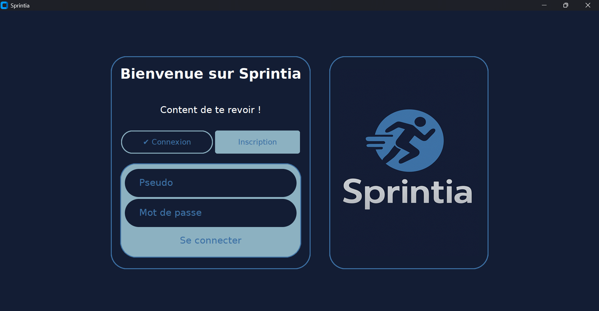
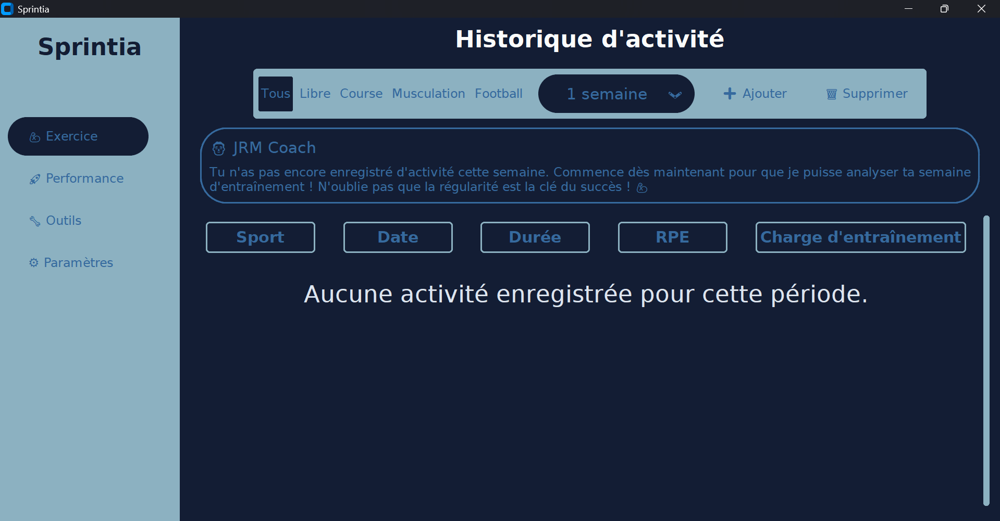
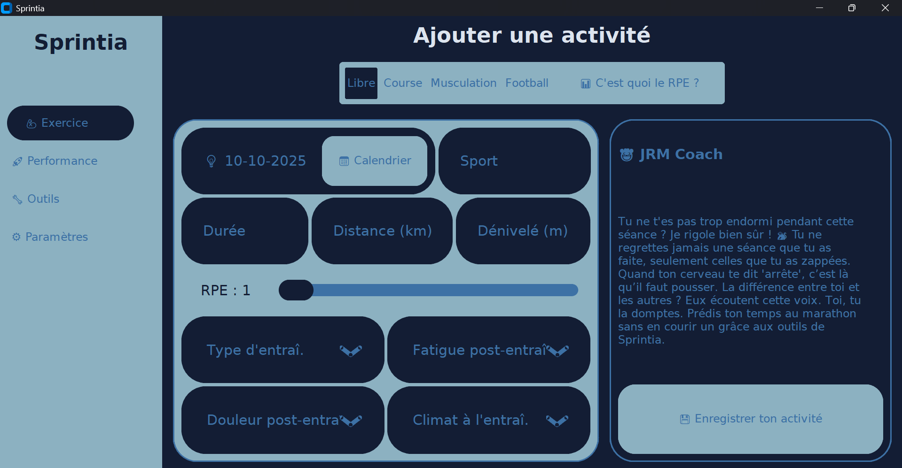
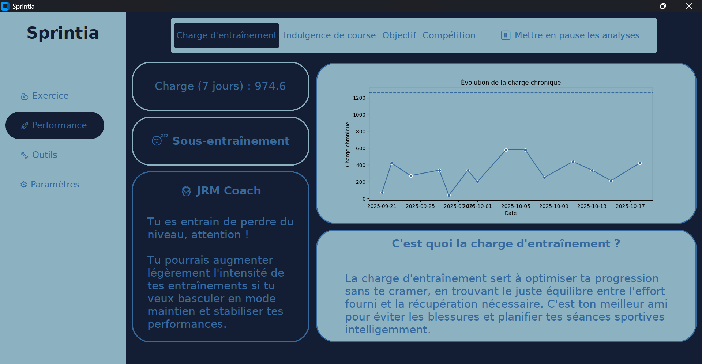
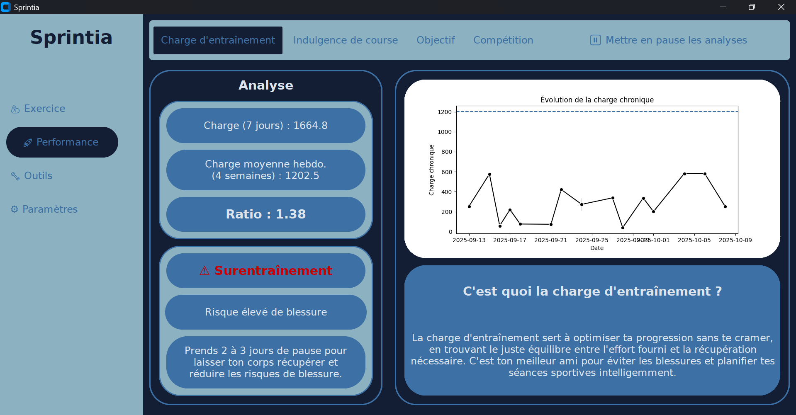

# Bienvenue sur Sprintia

## Quelques images de Sprintia :

## ℹ️ Petite information

Dans le monde du sport, un coach est un partenaire de confiance. C'est pour cette raison que j'ai choisi de te tutoyer dans l'application Sprintia et dans ce README. L'objectif est de créer une relation comme celle que tu pourrais avoir avec un coach sportif.

## 📌 Sprintia c'est quoi ?

Sprintia est conçue pour t'aider avant et après un entraînement grâce à des algorithmes qui te permettront de mieux t’entraîner :

### ◉ Charge d'entraînement
La charge d'entraînement va permettre aux sportifs d’adapter l’intensité et le volume de leurs entraînement futur et à venir. La charge 	d’entraînement permet de quantifier le stress physique imposé à un corps durant une période de une semaine.

### ◉ Indulgence de course
L’indulgence de course t’aide à ajuster ton kilométrage des 7 derniers jours pour rester dans une progression optimale pour tes futures 	entraînement, sans dépasser ta limite. Tu peux ainsi continuer à t’améliorer tout en réduisant les risques de blessure. 

### ◉ Prédicteur de performance
Le prédicteur de performance estime tes temps sur n'importe quelle distance (5 km, 10 km, semi-marathon, marathon) à partir d’une course récente.

### ◉ JRM Coach
Un coach totalement personalisable que ce soit le nom du coach, l'avatar, mais également le style, tu peux choisir : "Bienveillant", "Copain", "Strict & Motivant", "Inshape". Ce coach va te motiver et te donner des conseils/tips sur le sport.

## 💻 Systèmes d'exploitation compatibles

Sprintia est optimisée pour fonctionner sur :

✅ Windows 10 et Windows 11
✅ Tablettes sous Windows (grâce à la compatibilité avec Windows).

🐍 Version de Python L’application nécessite Python 3.10 minimum pour s’exécuter correctement.

## 📚 Guide d’installation de Sprintia

Temps estimé : ~20 à 40 minutes (si tu connais un peu tout ça)

Pour commencer, si Python n’est pas déjà installé sur ton ordinateur, télécharge-le et installe-le depuis le site officiel : https://www.python.org/downloads/

### 1️⃣ Installation des dépendances

◉  Télécharge tous les fichiers que tu peux trouver sur mon GitHub dans le dossier “Services Sprintia”

◉  Créer un nouveau dossier dans tes documents sur ton PC, tu peux le nommer comme tu veux, mais "Services Sprintia" est recommandé pour éviter toute confusion.

◉ Ensuite, tu n'as plus qu'à double-cliquer sur "Sprintia Setup"

◉ Une fois les bibliothèques installées, tu peux supprimer le dossier “Services Sprintia” de ton PC.

### 2️⃣ Création du dossier de Sprintia

◉ Créer un nouveau dossier dans tes documents sur ton PC, tu peux le nommer comme tu veux, mais "Sprintia" est recommandé pour éviter toute confusion.

◉ Télécharge tous les fichiers que tu peux trouver sur mon GitHub dans le dossier “Programme BÊTA" puis "Fichier code Sprintia".

◉ Ensuite, tu vas dans tes téléchargements dans l'explorateur de fichiers de ton PC puis tu copie tous les fichiers qui tu viens de télécharger puis tu colles tous ces fichiers dans le dossier que tu as crée au début du tuto que tu as probablement nommé "Sprintia"

◉ Désormais, tu n’as plus qu’a double-cliquer sur le fichier nommé "Sprintia.vbs" avec l’icône de Sprintia. Pour information, si c’est la première fois que tu lances Sprintia il se peut que Sprintia prenne du temps à s’ouvrir.

### 💡 Petit tips (optionnel mais pratique) ⬇️

◉ Fais un clic-droit sur "Sprintia.vbs" puis "Afficher d'autres options" puis "Envoyer vers" puis clique sur "Bureau (créer un raccourci)"

◉ Ensuite, va sur ton bureau tu verras un fichier nommé "Sprintia.vbs - Raccourci" fais un clic-droit dessus puis "Renommer" et renomme le "Sprintia" ça seras plus propre

◉ Pour finir, fais un clic-droit sur le fichier que tu viens de renommer puis clique sur "Propriétés" puis 
"Changer d'icône" puis sur "Parcourir" puis séléctionne "Bureau" (dans la fenêtre qui viens d'aparaître) puis sur le dossier nommé "Sprintia" puis tu ouvres le dossier qu'il y a à l'intérieur du dossier Sprintia et tu sélectionne le fichier "Logo-Sprintia-Sombre.ico" puis clique sur "Ouvrir" puis "OK" puis "Appliquer" puis "OK".

◉ Bravo ! Tu as réussi à faire le tips maintenant tu n'auras plus qu'a double-clic sur Sprintia avec l'icône et hop, Sprintia se lancera !

🎉 Désormais, je te laisse profiter de Sprintia ! Bon entraînement !