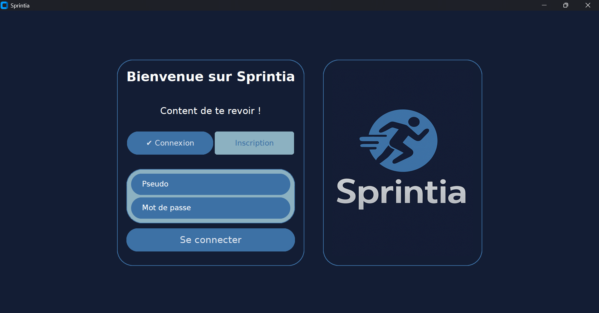

# Bienvenue dans Sprintia

## ℹ️ Petite information

Dans le monde du sport, un coach est un partenaire de confiance. C'est pour cette raison que j'ai choisi de te tutoyer dans l'application Sprintia et dans ce README. L'objectif est de créer une relation plus proche et personnelle avec toi, comme celle que tu aurais avec un coach sportif.

## 📌 Sprintia c'est quoi ?

Sprintia est conçue pour t'aider avant et après un entraînement grâce à des algorithmes (gratuits) :

Charge d'entraînement
Indulgence de course
Prédicteur de performance

## ⚡ Fonctionnalités principales

### Charge d'entraînement
La charge d'entraînement sert à optimiser ta progression sans te cramer, en trouvant le juste équilibre entre l'effort fourni et la récupération nécessaire.

### Indulgence de course
L’indulgence de course t’aide à ajuster ton kilométrage des 7 derniers jours pour rester dans une progression optimale, sans dépasser ta limite.

### Prédicteur de performance
Estime tes temps sur n'importe quelle distance (5 km, 10 km, semi-marathon, marathon) à partir de tes courses récentes.

## 📚 Guide rapide d’installation de Sprintia

Pour commencer, si Python n’est pas déjà installé sur ton ordinateur, télécharge-le et installe-le depuis le site officiel : https://www.python.org/downloads/

### 1️⃣ Création du dossier de Sprintia Ouvre ton explorateur de fichiers.

Crée un nouveau dossier. Tu peux le nommer comme tu veux, mais Sprintia est recommandé pour éviter toute confusion.

Télécharge tous les fichiers qu’il y a dans le dossier “Dernière version puis tu les mets dans le dossier que tu as créé dans ton PC à l’étape 2.

### 2️⃣ Ouverture du projet ● Important : ouvre le dossier complet dans ton éditeur de code (Visual Studio Code, PyCharm, Thonny,...), pas uniquement le fichier Sprintia. (Sinon, le programme ne trouvera pas les images et ne pourra pas fonctionner correctement.) Si tu n’as pas d’éditeur de code, suis ce tuto pour l’installer. Au début de la vidéo, il t’explique comment installer Python si c’est déjà fait tu peux sauter ce passage de la vidéo. Le lien ➡️ : https://www.youtube.com/watch?v=RHJHqMBN-LI

### 3️⃣ Installation des bibliothèques Va dans le dossier nommé “Services Sprintia”, puis télécharge le fichier “Sprintia Setup.py” puis lance le programme et suis les instructions. Une fois toutes ces étapes sont terminées, ouvre le dossier Sprintia dans Visual Studio Code. Lance le programme “Sprintia”, puis découvre Sprintia !

## 💻 Systèmes d'exploitation compatibles

Cette application, construite avec Custom Tkinter, est conçue pour fonctionner parfaitement sur les principaux systèmes d’exploitation de bureau. ✅ Windows : Toutes les versions modernes sont prises en charge.

✅ macOS : Compatible avec les versions récentes.

✅ Linux : Fonctionne sur les distributions les plus courantes.

🐍 Version de Python L’application nécessite Python 3.0 minimum pour s’exécuter correctement.

🔹 Recommandation : utiliser Python 3.13 ou supérieur pour une compatibilité optimale.

📱 Compatibilité mobile et tablette ❌ Smartphones (iOS / Android) : Non disponible.

⚠️ Tablettes :

Non optimisée pour les interfaces tactiles.
Utilisable uniquement sur une tablette Windows, grâce à la compatibilité avec son OS.